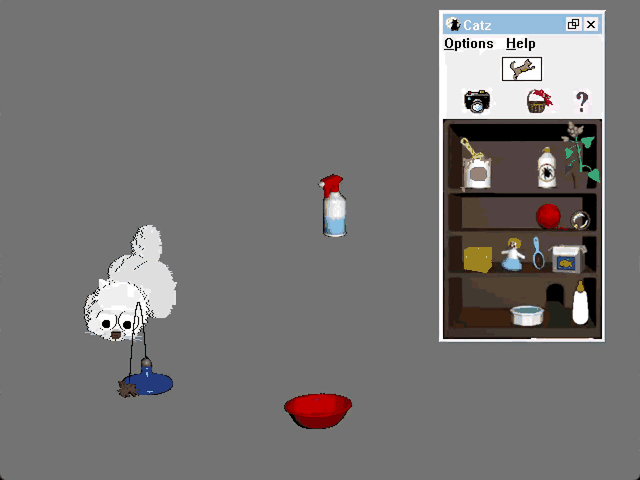

# CATZ Static Recompilation

Static recompilation of **Catz** (1996, PF Magic) from its 16-bit NE engine DLL
to native C for Windows 11. The engine — the famous "ball-and-stick" Petz
engine — lives entirely in `CATZDLL.DLL`; `CATZ.EXE` is a thin launcher and
`CATZ.WAD` is the host shell. This project lifts both NE modules to C and
reimplements their Win16 API dependencies on top of Win32/GDI32.



*Recompiled Catz: a Persian kitten batting a cat dancer around the playpen, with
the toy shelf, its panel chrome and its menus all drawn by the original engine.*

Built on the [pcrecomp](https://github.com/sp00nznet/pcrecomp) NE toolchain,
following [elfish](https://github.com/sp00nznet/elfish) (the proven end-to-end
NE→C recomp) as the structural template. The difference: El-Fish was a
self-contained DOS-extender; CATZ is a real Windows 3.1 application, so the
runtime is a **Win16 API shim layer** rather than DOS interrupt handlers.

## Status

The game is playable. `build/catz.exe` boots CATZDLL + CATZ.WAD, opens a real
Win32 window, and runs the engine's own frame loop against the original assets.

Working:

- **The playpen renders** — tiled wallpaper, toy shelf, and the pet drawn by the
  engine's ball rasteriser from the real `.lnz`/`.bdt` geometry, at the ~18 fps
  the engine was written for.
- **The pet behaves** — the full state machine: idling, exploring, locomoting,
  stalking, swatting, eating, suckling, sleeping, plus the mouse in its hole.
- **Toys work** — drag any of them off the shelf; the cat plays with them, and
  Clean Up Toys puts them back.
- **Adoption works** end to end: Adopt Me Now, pick a breed from the five
  portraits, name the cat, and it joins the playpen.
- **The shelf panel is real** — caption bar, system menu, and the Options and
  Help menus, all drawn and hit-tested by the engine.
- **Saving works**, so the game keeps its settings and your cat between runs.

Not working yet:

- The four Options entries that open dialogs (General Options, CatNapz Options,
  Choose Another Kitten, Create Adoption Kit) highlight but never reach a dialog
  call. Everything else on the menu works.
- No audio. The engine asks for it (`SNDPLAYSOUND`, the SOS ordinals) and the
  calls are stubs.
- The engine logs `sqrt: DOMAIN error` a few hundred times a session; harmless
  so far, but it means something is handing `sqrt` a negative.

Twelve Win16 imports the engine actually reaches are still stubs; run with
`CATZ_STUB_HITS=1` for the current list.

## Building

The lifted C is **not** in this repository. It is a machine translation of the
retail game's own code, so it is not redistributable — you generate it from your
own copy, the same way you supply the game data. With `CATZ_DATA_DIR` pointing
at your install:

```bash
python tools/lift_dll.py            # CATZDLL.DLL  -> src/seg001..059.c
python tools/lift_wad.py            # CATZ.WAD     -> src/seg060..066.c
python tools/patch_lifted.py        # EH cleanup-chain guards (do not skip)
python tools/gen_segments_h.py      # cross-segment prototypes
python tools/gen_dispatch.py        # indirect call/jmp dispatcher
python tools/gen_stubs.py           # stubs for unresolved targets
python tools/gen_win16_stubs.py     # Win16 stubs with PASCAL purge
python tools/gen_image_combined.py  # flat memory image

cmake -B build -A Win32             # 16-bit origin -> 32-bit native target
cmake --build build
```

Re-run the lift steps after any change to the decoder or lifter; skipping
`patch_lifted.py` silently drops the exception-handling guards.

Compiler is MSYS2 mingw64 gcc — `PATH` must include `C:/msys64/mingw64/bin`.
**`-O2` is required for correctness**: the lifter turns intra-segment jumps into
tail calls, and at `-O0` guest loops become host recursion and blow the stack.
It is pinned in `CMakeLists.txt`.

## You must supply your own game files

Nothing from the retail game is redistributable, so `game/` and the data tree
are gitignored and you bring your own. Point `CATZ_DATA_DIR` (in
`CMakeLists.txt`) at a real install — the directory containing `PTZFILES`,
`PLAYPENZ` and `SOUNDS`.

### …including your own serial number

Catz asks for a serial number on first run, and this project ships neither one
nor any way around one. It is licence data belonging to your copy of the game.
Put it where the game already looks — `catz.ini` in the install root:

```ini
[Catz]
Serial Number=XXXX-XXXX-XXXX
```

Without it the engine stops on its registration screen and the playpen is never
reached. The runtime says so plainly on startup rather than leaving you to work
it out from the wizard.

Note that the game now **writes** to that install: it saves settings, the date
and your adopted cat back to its `.cat` file, exactly as the original did. Keep
a copy of anything you care about.

## Layout

```
tools/      NE toolchain (adapted from elfish; win16.py replaces tsxlib.py)
runtime/    cpu.h (CPU+FPU model), Win16 shims, main host loop
src/        lifted C, one seg*.c per code segment (generated)
analysis/   recon outputs + IDA exports
docs/       architecture, the Win16 layer, diagnostics, defect writeups
build_data/ flat memory image (generated, gitignored)
game/       original binaries (gitignored, not redistributable)
```

## Licence, and what it does not cover

The code in this repository — the NE toolchain in `tools/`, the runtime and
Win16 shim layer in `runtime/`, and the documentation — is MIT licensed. See
[LICENSE](LICENSE).

That covers this project's own work and nothing else. **Catz is not included and
is not licensed here.** The game binaries, its data files, its artwork and
sounds, and your serial number all belong to your own copy and stay there:
`game/`, the data tree and `build_data/` are gitignored, and so is the lifted
`src/`, which is a machine translation of the game's own code. Catz is
© 1996 PF Magic. This is an interoperability and preservation exercise; you need
a copy you already own for any of it to run.

## Documentation

| Page | What is in it |
|------|---------------|
| [Architecture](docs/architecture.md) | Module layout, the lift pipeline and its results, where the render actually lives, build notes that are easy to lose |
| [The Win16 layer](docs/win16-layer.md) | How the shims work, and the recurring shapes of bug — a stub returning 0 is not neutral, the PASCAL purge has to be exact, a WinG DC is not a host DC |
| [Diagnostics](docs/diagnostics.md) | Every in-tree instrument, including how to drive the whole UI headlessly without touching the mouse |
| [Lifter defects](docs/lifter-bugs.md) | The silent ones: segment overrides, indirect jumps, stack leaks, five x87 faults |
| [Investigations](docs/investigations.md) | Traces kept for the method rather than the conclusion |
